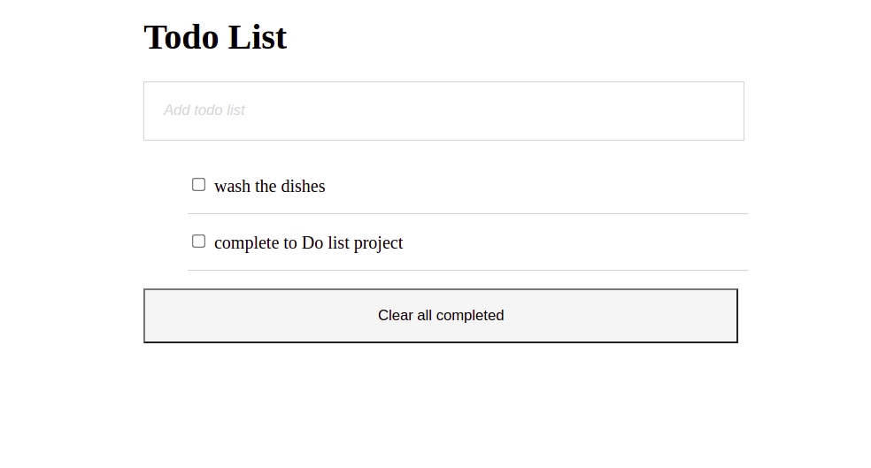

# To-do list

> In this project, I have built a simple HTML list of To Do tasks.



In this project, you will build a simple HTML list of To Do tasks. The list will be styled according to the specifications listed later in this lesson.

## Built With

- [HTML](https://www.w3schools.com/html/)
- [CSS](https://www.w3schools.com/css/)
- [JS](https://www.javascript.com/)


## Live Demo

[Live Demo Link](https://obote.github.io/Todos/)


## Getting Started

**This is an example of how you may give instructions on setting up your project locally.**
**Modify this file to match your project, remove sections that don't apply. For example: delete the testing section if the currect project doesn't require testing.**


To get a local copy up and running follow these simple example steps.

### Prerequisites

* No prerequisites needed for this project.
<!-- ### Setup -->

### Install

1. Clone the repo
   ```sh
   git clone git@github.com:Obote/Todo-List.git
   ```
2. Install NPM packages
   ```sh
   npm install
   ```

### Usage

* Practice basic UI usage with vanila Javascript

<!-- ### Deployment -->


## Authors

👤 **Denis Obote**

- GitHub: [@Obote](https://github.com/Obote)
- Twitter: [@Obote_denis](https://twitter.com/Obote_denis)
- LinkedIn: [Obote Denis](https://www.linkedin.com/in/obote-denis-9859a2a3/)


## 🤝 Contributing

Contributions are what make the open source community such an amazing place to be learn, inspire, and create. Any contributions you make are **greatly appreciated**.

1. Fork the Project
2. Create your Feature Branch (`git checkout -b feature/NewFeature`)
3. Commit your Changes (`git commit -m 'Add some NewFeature'`)
4. Push to the Branch (`git push origin feature/NewFeature`)
5. Open a Pull Request


Feel free to check the [issues page](../../issues/).

## Show your support

Give a ⭐️ if you like this project!

## Acknowledgments

- Myself for working extrahard to achieve this.

## 📝 License

This project is [MIT](./MIT.md) licensed.